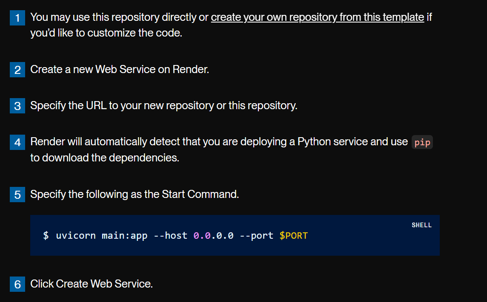

# FastAPI Demo - A Mini Project

## This repository contains the code for creating an API that returns the Car Prices prediction from a Machine Learning model using FastAPI

### Files:
  - `car-details.csv` - Dataset
  - `predictor_nb.ipynb` - Juputer notebook for training the model
  - `model.joblib` - Saved model
  - `main.py` - Python script for creating the API
  - `test.py` - Python script for interacting with API using Requests module
  - `car_data_model.py` - Python script for creating the Pydantic datamodel for new data

### Link to the API:
  - [API Home](https://fastapi-temp1.onrender.com)
  - [API Docs](https://fastapi-temp1.onrender.com/docs)

### Steps to Deploy API using Render:

